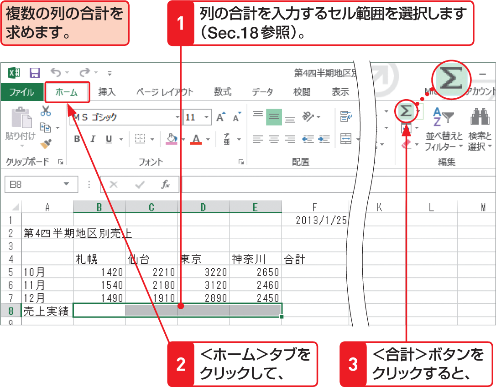

# Section 20 合計や平均を計算する

## 複数の列や行の合計をまとめて求める

### [Memo] 複数の列の合計をまとめて求める

複数の列の合計をまとめて求めるには、右の手順のように、列の合計を入力するセル範囲を選択して、＜ホーム＞タブの＜編集＞グループにある＜合計＞ボタン  の  をクリックします。同様の操作を行に対して行えば、複数の行の合計をまとめて求めることができます。
