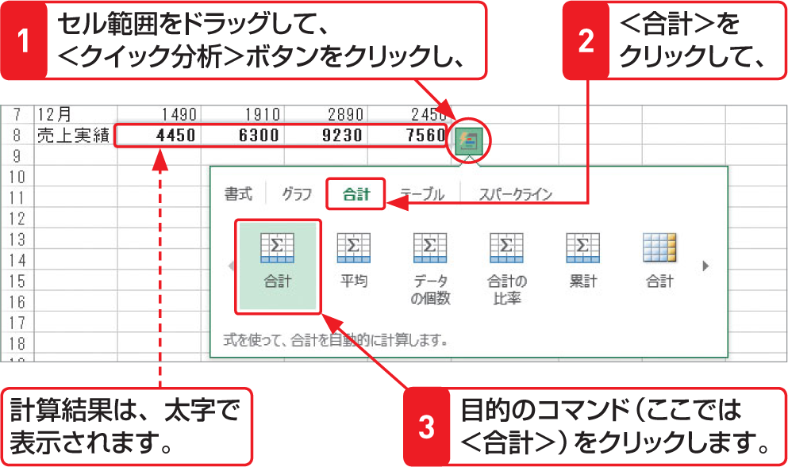

# Section 20 合計や平均を計算する

## 平均を求める

### [New] ＜クイック分析＞ボタンの利用

Excel 2013では、連続したセル範囲の合計や平均を求める場合に、＜クイック分析＞ボタンを利用することができます。  
目的のセル範囲をドラッグして、右下に表示される＜クイック分析＞ボタン  をクリックします。メニューが表示されるので、＜合計＞をクリックして、目的のコマンドをクリックします。メニューの左右にある矢印をクリックすると、隠れているコマンドが表示されます。

