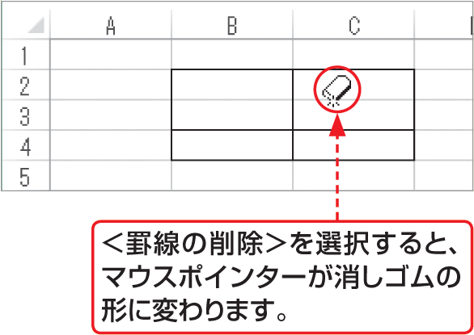

# Section 21 罫線を引く

## ＜罫線＞ボタンを利用して斜線を引く

### [Hint] 罫線の一部を削除するには？

罫線の一部を削除するには、左上段図の方法で表示される罫線メニューから＜罫線の削除＞をクリックします。マウスポインターが消しゴムの形に変わるので、罫線を削除したい場所をドラッグ、またはクリックします。削除し終わったら[key: Esc]キーを押して、マウスポインターを元の形に戻します。

