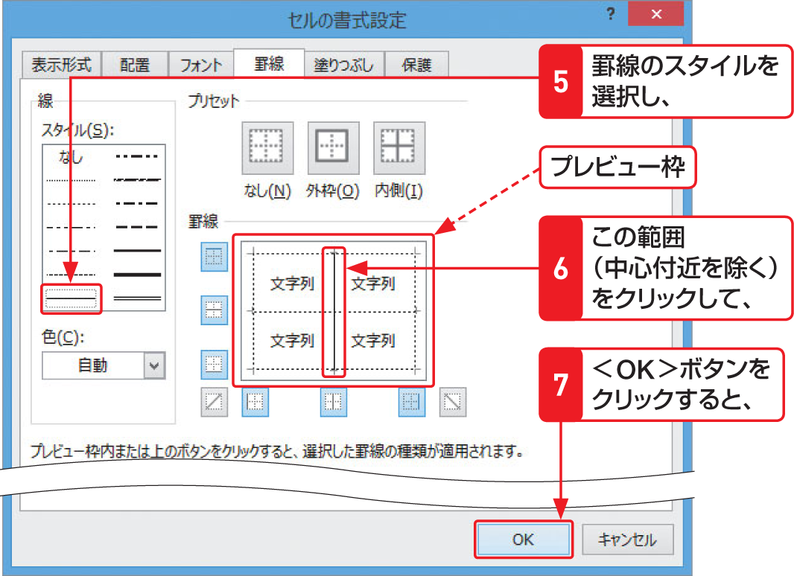

# Section 21 罫線を引く

## ＜セルの書式設定＞ダイアログボックスを利用する

### [Hint] 罫線を引くボタンの利用

＜セルの書式設定＞ダイアログボックスで、罫線のスタイルを選択後、プレビュー枠の周囲にあるボタンをクリックすると、罫線を引く位置を簡単に指定することができます。罫線を引くボタンには、選択したセル範囲の上下や左右の辺に罫線を引くボタンと、セルの内側の枠に罫線を引くボタン、斜線を引くボタンがあります（左中段図参照）。
