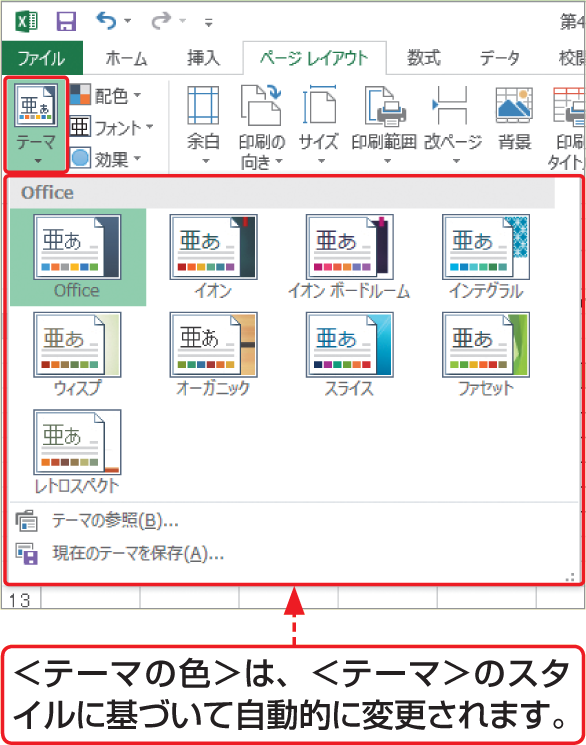

# Section 22 セルの背景に色を設定する

## セルの背景に＜テーマの色＞を設定する

### [Hint] テーマの色

＜テーマの色＞で設定する色は、＜ページレイアウト＞タブの＜テーマ＞グループにある＜テーマ＞の設定に基づいています。＜テーマ＞でスタイルを変更すると、＜テーマの色＞で設定した色を含めてブック全体が、選択したテーマに基づいて自動的に変更されます。それに対し、＜標準の色＞で設定した色は、＜テーマ＞の変更に影響を受けません。

