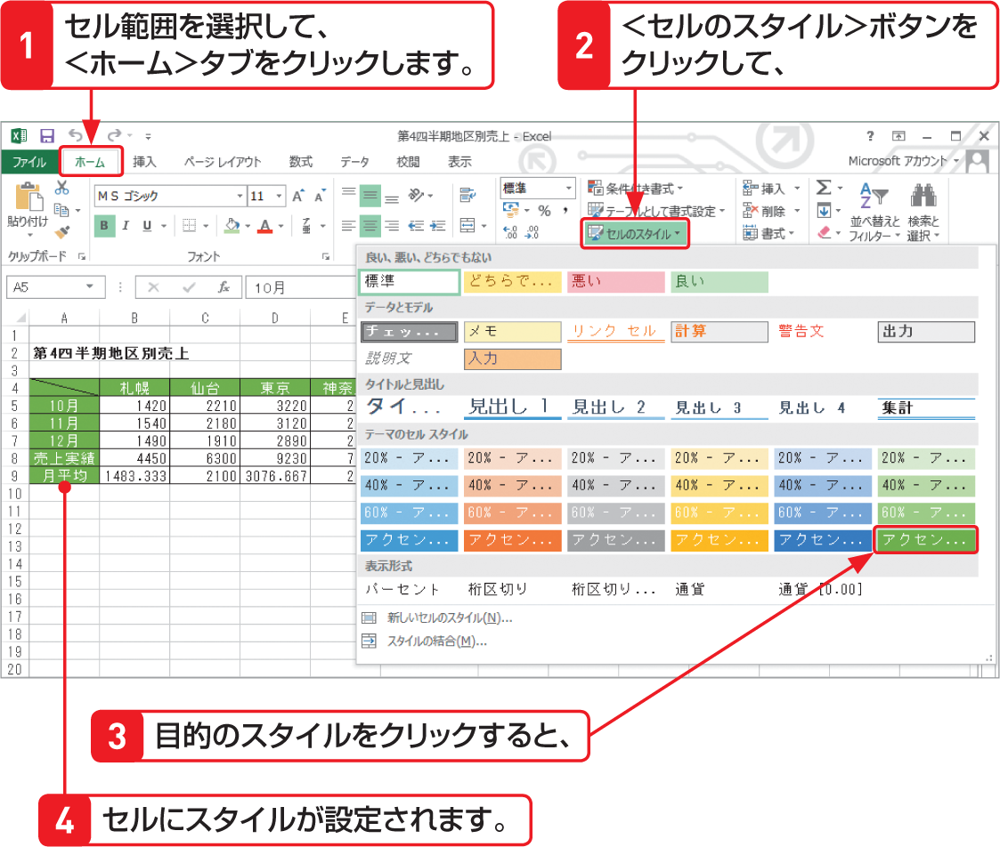

# Section 23 見出しの文字書式を設定する

## 見出しの文字列を中央揃えにする

### [Stepup] ＜セルのスタイル＞を利用する

＜ホーム＞タブの＜スタイル＞グループにある＜セルのスタイル＞ボタンを利用すると、あらかじめ用意された見出しの書式やセルのスタイルを設定することができます。  
右の例では、列と行見出しのスタイルを設定しています。なお、設定したスタイルを解除するには、一覧の左上にある＜標準＞をクリックします。

