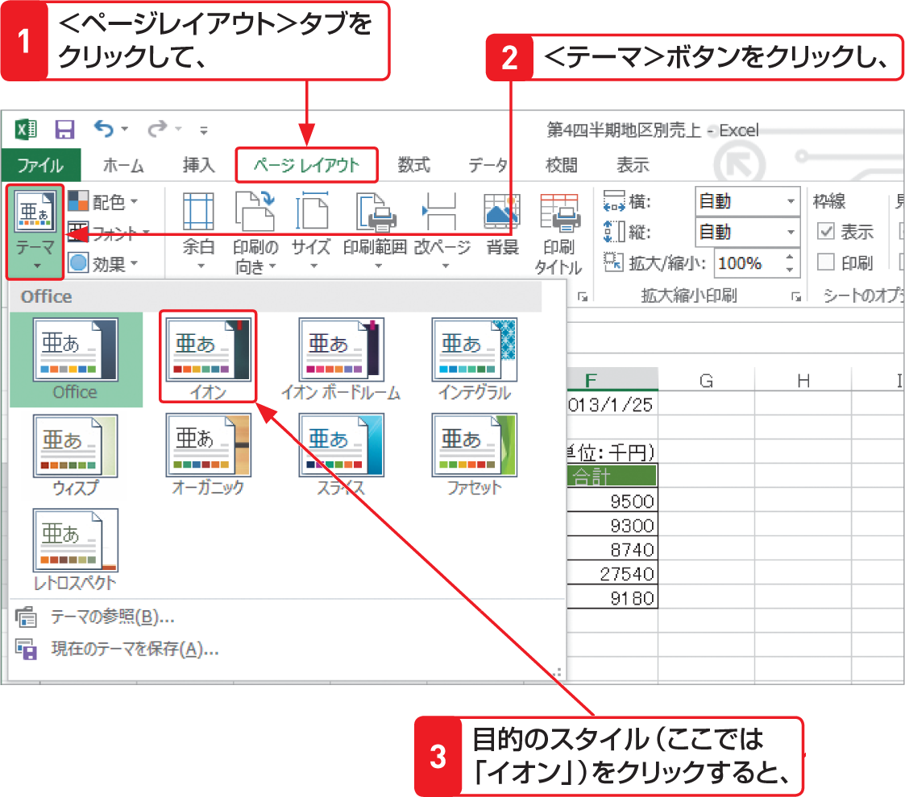

# Section 23 見出しの文字書式を設定する

## 見出しの文字列を中央揃えにする

### [Stepup] テーマを設定する

「テーマ」は、フォントの種類やセルの背景色、罫線と塗りつぶしの効果などの書式をまとめたもので、ブック全体の書式をすばやく簡単に設定できる機能です。テーマでスタイルを変更すると、P.329で設定した＜テーマの色＞や＜セルのスタイル＞（上のStepup 参照）で設定した色を含めて、ブック全体が選択したテーマに基づいて、自動的に変更されます。

