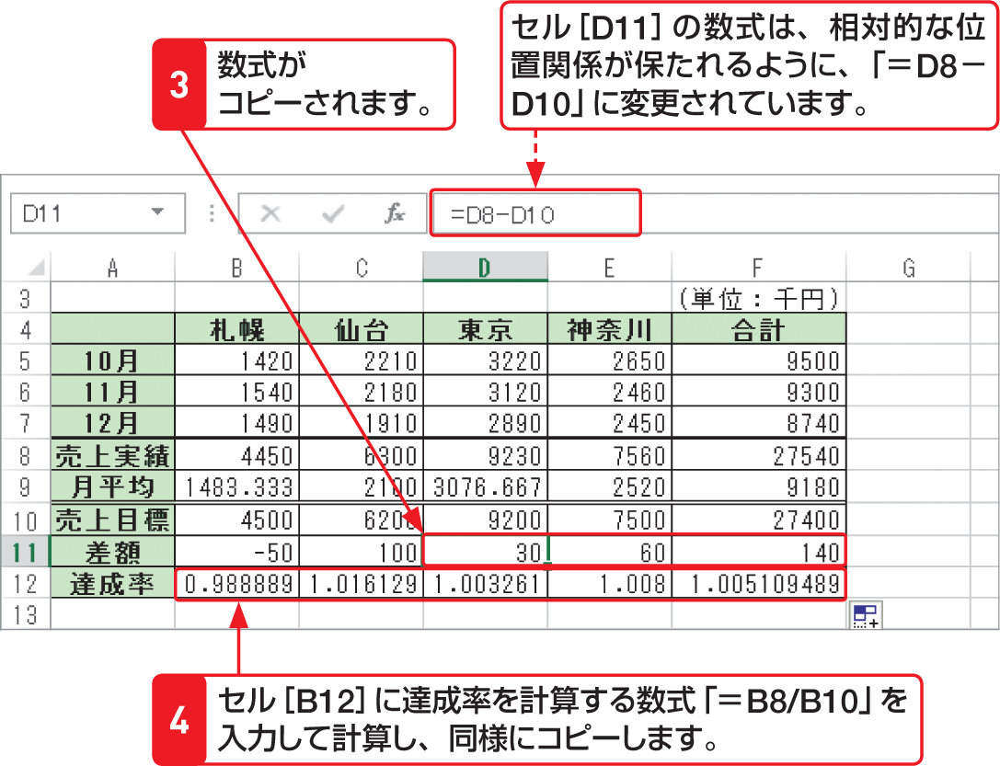

# Section 24 数式を入力する

## 他のセルに数式をコピーする

### [Memo] 数式が入力されているセルのコピー

相対参照の数式が入力されているセルをコピーすると、参照先のセルもそのセルと相対的な位置関係が保たれるように、セル参照が自動的に変化します。左の手順では、コピー元の「=C8－C10」という数式が、セル［D11］では「=D8－D10」という数式に変化しています。
