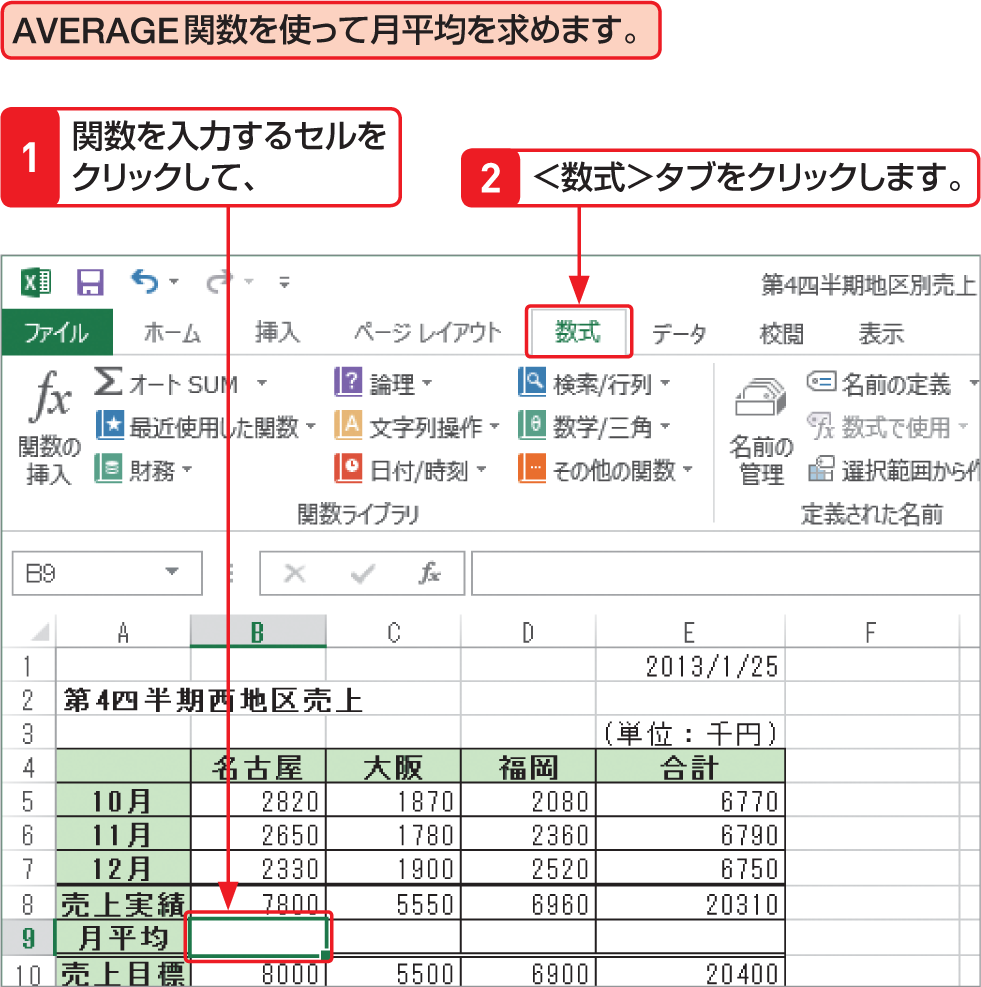

# Section 25 関数を入力する

## ＜関数ライブラリ＞から関数を入力する

### [Memo] ＜関数ライブラリ＞の利用

＜数式＞タブの＜関数ライブラリ＞グループには、関数が分類されたボタンが用意されています。ボタンをクリックすると、その分類に含まれている関数が表示され、そこから目的の関数を選択できます。AVERAGE関数は、＜その他の関数＞ボタンの＜統計＞に含まれています。
