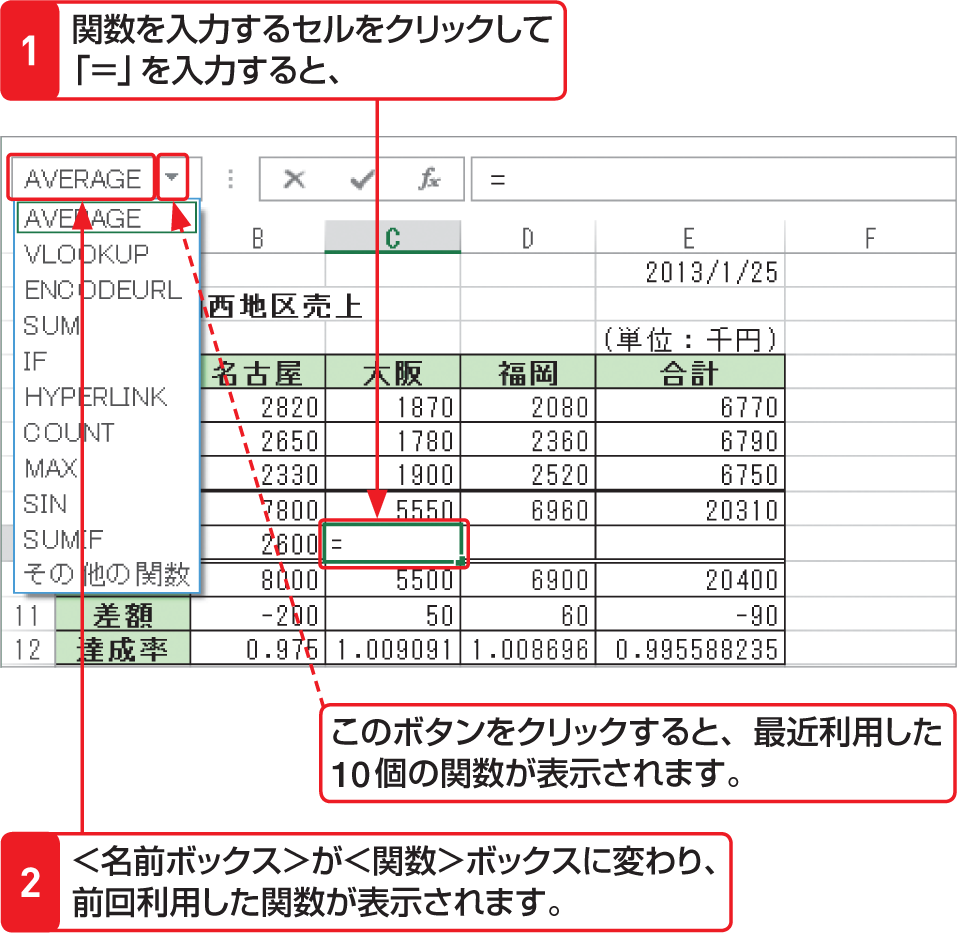

# Section 25 関数を入力する

## ＜関数ライブラリ＞から関数を入力する

### [Stepup] ＜関数＞ボックスの利用

関数を入力するセルをクリックして「＝」を入力すると、＜名前ボックス＞が＜関数＞ボックスに変わり、前回利用した関数が表示されます。また、ボタンをクリックすると、最近利用した10個の関数が表示されます。いずれかの関数をクリックすると、＜関数の引数＞ダイアログボックスが表示され、その関数の引数を入力することができます。

