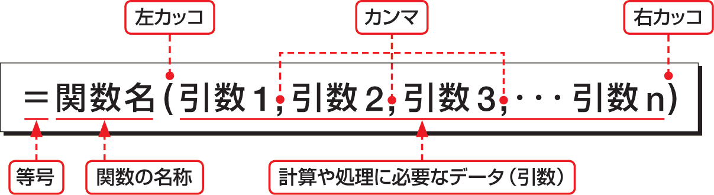

# Section 25 関数を入力する

### 関数の書式

関数は、先頭に「＝（等号）」を付けて関数名を入力し、後ろに引数をかっこ「（ ）」で囲んで指定します。引数とは、計算や処理に必要な数値やデータのことで、種類や指定方法は、関数によって異なります。  
複数の引数がある場合は、引数と引数の間を「,（カンマ）」で区切ります。関数名や「＝」「(」「,」「)」などはすべて半角で入力します。

