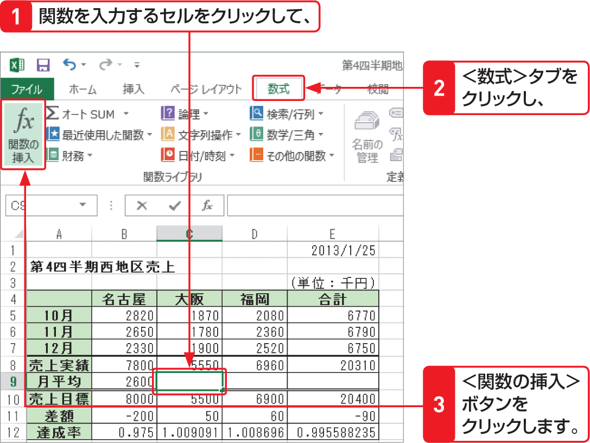

# Section 25 関数を入力する

## ＜関数の挿入＞ボタンから関数を入力する

### [Memo] ＜関数の挿入＞ボタンを利用する

＜数式＞タブの＜関数の挿入＞ボタンを利用して関数を入力することもできます。＜関数の挿入＞ボタンをクリックすると、＜関数の挿入＞ダイアログボックスが表示されるので、＜関数の分類＞ボックスから関数の分類を選択し、＜関数名＞ボックスから目的の関数を選択します。
