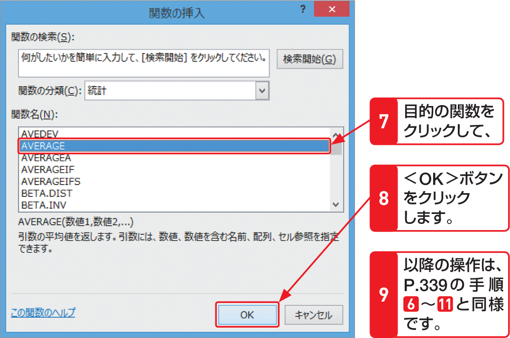

# Section 25 関数を入力する

## ＜関数の挿入＞ボタンから関数を入力する

### [Memo]関数を検索するには？

使用したい関数がわからない場合は、＜関数の挿入＞ダイアログボックスで、目的の関数を探すことができます。＜関数の検索＞ボックスに、関数を使って何を行いたいのかを簡潔に入力し、＜検索開始＞ボタンをクリックすると、＜関数名＞に条件に該当する関数の候補が表示されます。
