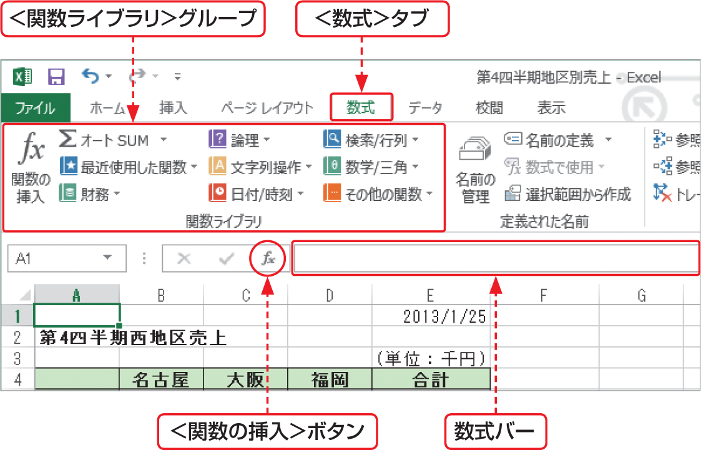

# Section 25 関数を入力する

## キーボードから関数を直接入力する

### [Memo] 関数の入力方法
Excelで関数を入力するには、次の5とおりの方法があります。

&#9312; ＜数式＞タブの＜関数ライブラリ＞にある各種ボタンを使う。  
&#9313; ＜数式＞タブの＜関数ライブラリ＞にある＜関数の挿入＞ボタンを使う。  
&#9314; ＜数式＞バーにある＜関数の挿入＞ボタンを使う。  
&#9315; ＜数式＞バーを使う。  
&#9316; セルに直接関数を入力する。

また、＜関数ライブラリ＞にある＜最近使用した関数＞ボタンをクリックすると、最近使用した関数が10個表示されます。そこから関数を入力することもできます。
