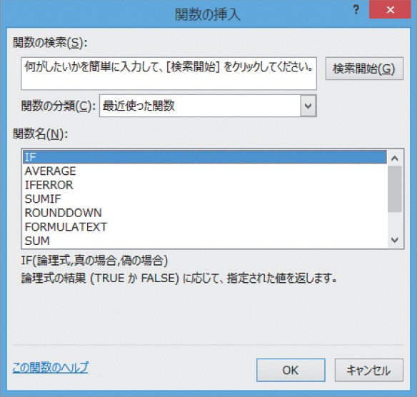

# Section 26 関数を組み合わせる

## 内側に追加する関数を指定する

### [Hint] 最近使用した関数に目的の関数がない…

＜関数＞ボックスの＜最近使用した関数＞の一覧に目的の関数が表示されない場合は、メニューの最下段にある＜その他の関数＞をクリックします（左上から2番目の図参照）。＜関数の挿入＞ダイアログボックスが表示されるので、この画面から目的の関数を選択します。

