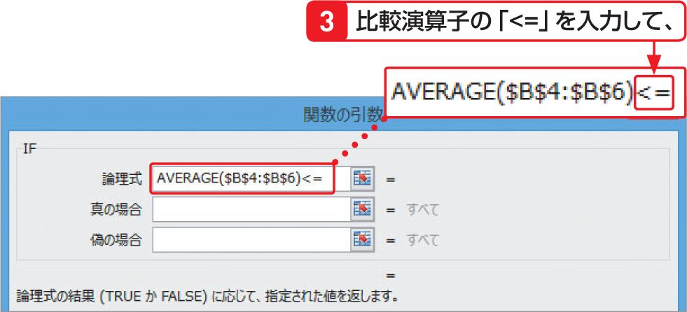

# Section 26 関数を組み合わせる

## 最初の関数に戻って引数を指定する

### [Hint]＜関数の引数＞ダイアログボックスの切り替え

関数をネストした場合は、右上から3番目の図のように、数式バーの関数名をクリックして、＜関数の引数＞ダイアログボックスの内容を切り替えるのがポイントです。右の手順の場合は、AVERAGE関数からIF関数のダイアログボックスに切り替えています。
