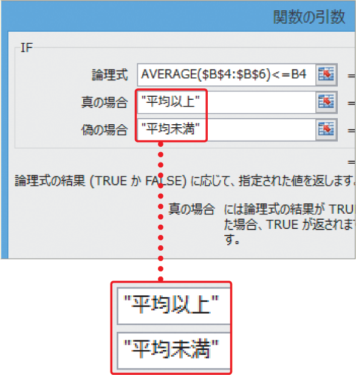

# Section 26 関数を組み合わせる

## 最初の関数に戻って引数を指定する

### [Hint]「"（ダブルクォーテーション）」の入力

引数の中で文字列を指定する場合は、半角の「"（ダブルクォーテーション）」で囲む必要があります。＜関数の引数＞ダイアログボックスを使った場合は、＜真の場合＞＜偽の場合＞に文字列を入力してカーソルを移動したり、＜OK＞ボタンをクリックすると、「"」が自動的に入力されます。

