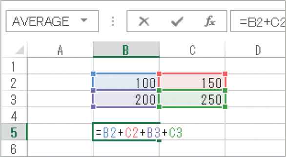

# Section 27 数式の参照範囲を変更する

## 数式の参照先のセル範囲を広げる

### [Stepup] 数式の中に複数のセル参照がある場合

1つの数式の中で複数のセル範囲を参照している場合、数式内のセル番地はそれぞれが異なる色で表示され、対応する参照先のセルの枠も同じ色で表示されます。そのため、目的のセル番地を修正するにはどこを変更すればよいのかが、枠の色で判断できます。

