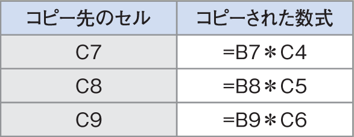

# Section 29 絶対参照を利用する

## 相対参照でコピーするとエラーが表示される

### [Memo] 相対参照と絶対参照
右の手順で原価額のセル［C6］をセル範囲［C7:C9］にコピーすると、相対参照を使用しているために、セル［C3］へのセル参照も自動的に変更されてしまい、計算結果が正しく求められません（右下段図参照）。

数式をコピーしても、参照するセルを常に固定したいときは、絶対参照を利用します（右ページ参照）。
