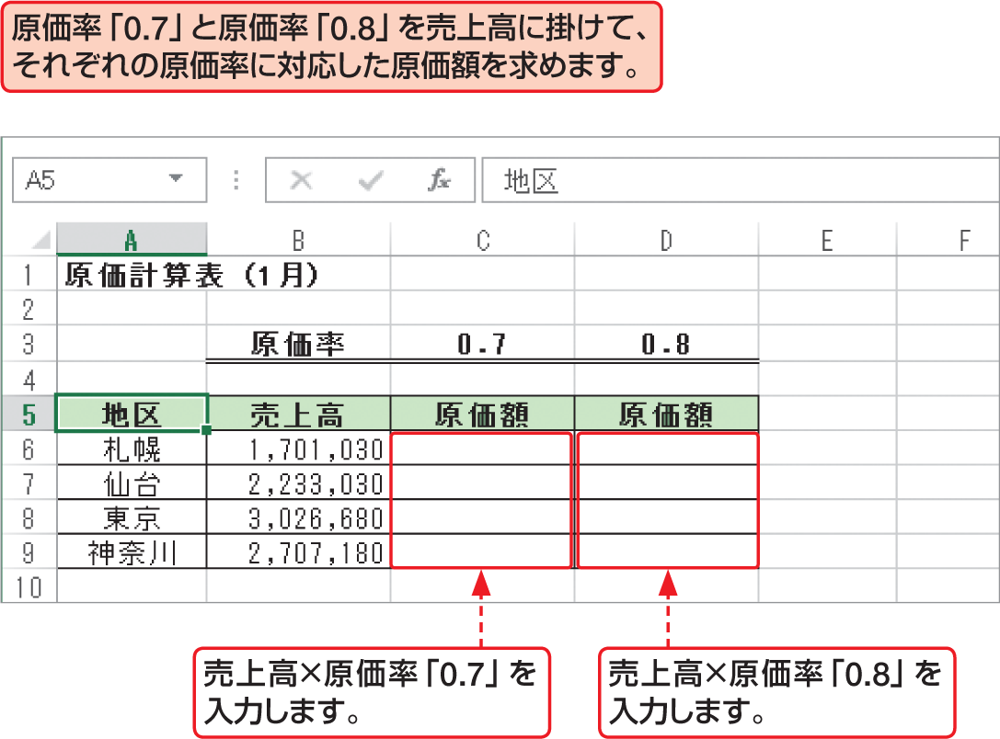

# Section 30 複合参照を利用する

## 複合参照でコピーする

### [Memo] 複合参照の利用

右図のように、列［B］に「売上高」、行［3］に「原価率」を入力し、それぞれの項目が交差する位置に原価額を求める表を作成する場合、原価額を求める数式は、常に列［B］と行［3］のセルを参照する必要があります。このようなときは、列または行のいずれかの参照先を固定する参照方式の複合参照を利用します。
