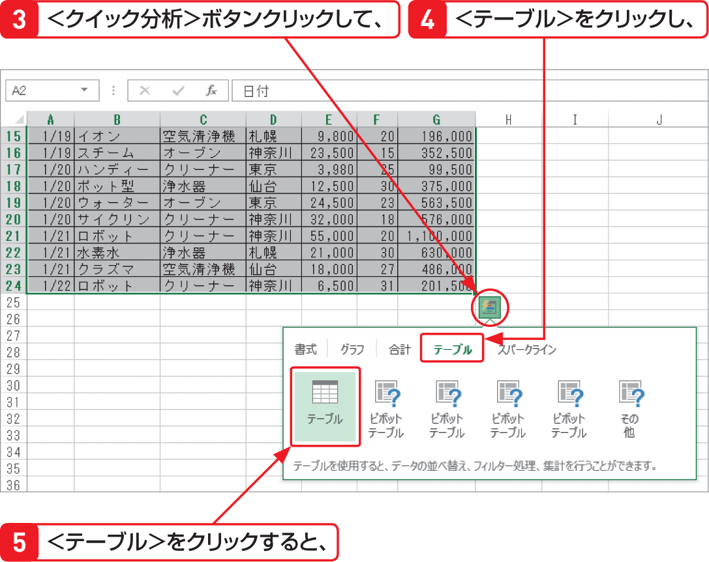

# Section 31 構造化参照を利用する

## 表をテーブルに変換する

### [New] ＜クイック分析＞ボタンの利用

Excel 2013では、＜クイック分析＞ボタンを利用して簡単にテーブルを作成することができます。テーブルに変換する範囲を選択すると、右下に＜クイック分析＞ボタン  が表示されます。そのボタンをクリックするとメニューが表示されるので、＜テーブル＞をクリックして、＜テーブル＞をクリックします。
