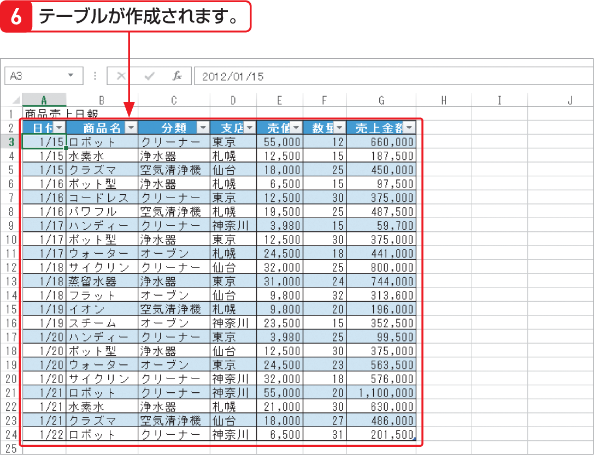

# Section 31 構造化参照を利用する

## 表をテーブルに変換する

### [Keyword] 指定子

構造化参照の「指定子」とは、データまたはデータ範囲を示すもので、列指定子や特殊項目指定子などがあります。列指定子は「商品名」や「売上金額」などのテーブルの列見出しを示すものです。指定子は「［ ］」で囲む必要があります（P.356上図参照）。「特殊項目指定子」は、テーブルのさまざまな部分を数式で簡単に参照するための項目です。列見出し、データ、集計などを含むテーブル全体を示す「#すべて」、データのみを示す「#データ」などがあります（P.359の上段図のリスト参照）。
