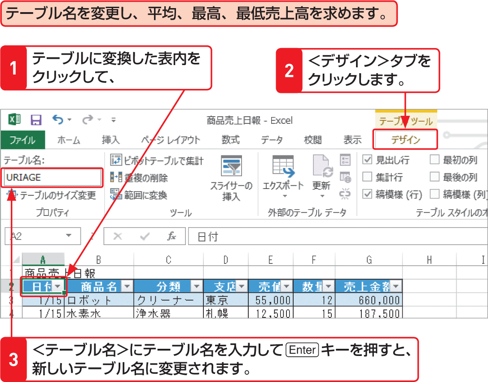

# Section 31 構造化参照を利用する

## 構造化参照を利用する

### [Hint] テーブルの名称

データベース形式の表をテーブルに変換すると、「テーブル1」、「テーブル2」…というようにテーブル名が付けられます。通常、このテーブル名は扱いやすいように変更して使いますが、「テーブル1」のままで使うこともできます。なお、テーブル名は、「URIAGE」のような英数字だけではなく、「売上」のように日本語（全角文字）を使用することができます。
