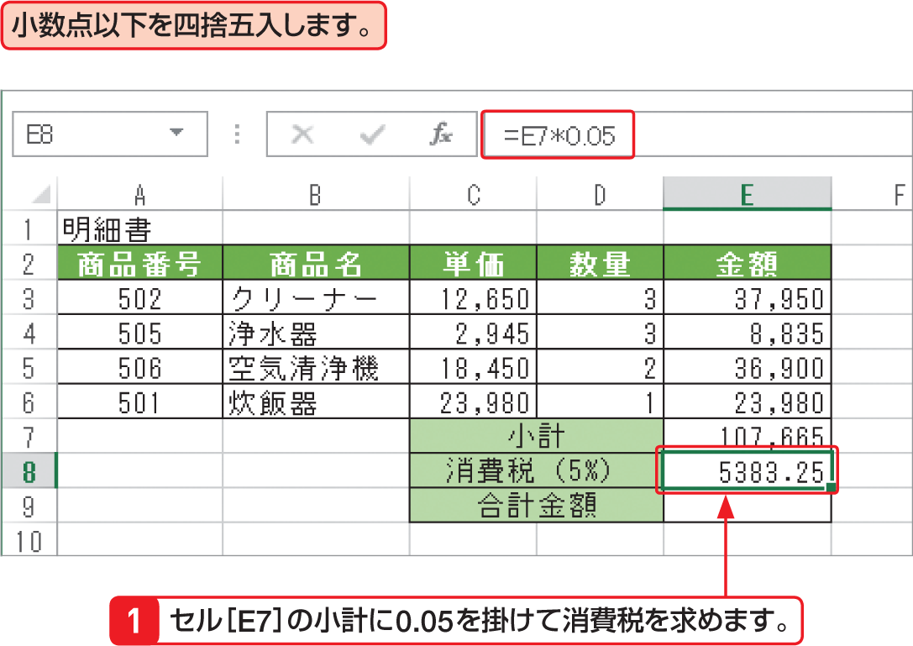

# Section 32 代表的な関数を利用する

## 数値を四捨五入する関数－ROUND

### [Keyword] ROUND関数
「ROUND関数」は、指定した桁数で数値を四捨五入する関数です。引数「数値」には、四捨五入の対象にする数値や数値を入力したセルを指定します。「桁数」には、四捨五入した結果の小数点以下の桁数を指定します。「0」を指定すると、小数点以下第1位で四捨五入されます。小数点以下第2位で四捨五入する場合は「1」を、1の位で四捨五入する場合は「－1」を指定します。  
<em>書式：</em>＝ ROUND（数値, 桁数）  
<em>関数の分類：</em>数学／三角関数
