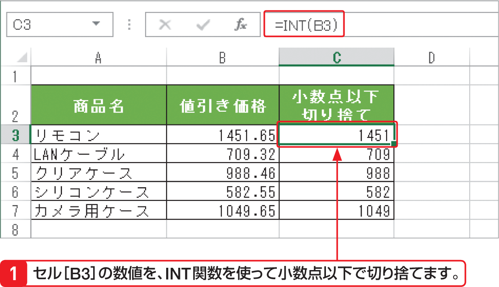

# Section 32 代表的な関数を利用する

## 数値を切り捨てる関数－INT

### [Keyword] INT関数
「INT 関数」は、引数「数値」に指定した値を超えない最大の整数を求める関数です。たとえば、数値が正の数の「12.3」の場合は、結果が「12」となります。負の数の「－12.3」の場合は、小数点以下を切り捨ててしまうと「－12」となり「－12.3」より値が大きくなるため、結果は「－3」になります。  
<em>書式：</em>＝ INT（数値）  
<em>関数の分類：</em>数学／三角関数
