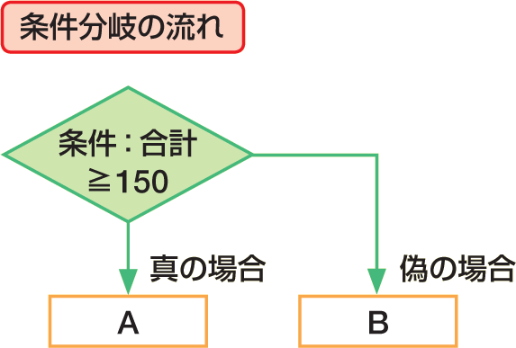

# Section 32 代表的な関数を利用する

## 数値を切り捨てる関数－INT

### [Keyword] IF関数
「IF関数」は、条件を満たすかどうかで処理を振り分ける関数です。条件を「論理式」で指定し、その条件が満たされる場合に「真の場合」で指定した値を返し、満たされない場合に「偽の場合」で指定した値を返します。  
<em>書式：</em>＝ IF（論理式, 真の場合, 偽の場合）  
<em>関数の分類：</em>論理関数

