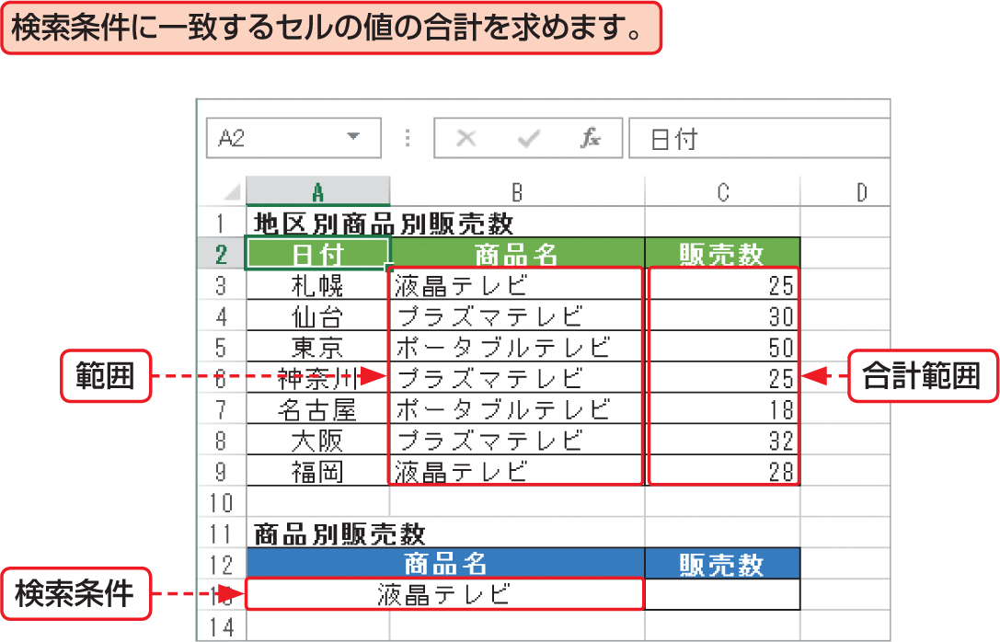

# Section 32 代表的な関数を利用する

## 条件を満たす数値の合計を求める関数－SUMIF

### [Keyword] SUMIF関数
「SUMIF関数」は、引数に指定したセル範囲から、検索条件に一致するセルの値の合計値を求める関数です。引数「範囲」を指定すると、検索条件に一致するセルに対応する「合計範囲」のセルの値を合計します。  
<em>書式：</em>＝ SUMIF（範囲, 検索条件,合計範囲）  
<em>関数の分類：</em>数学／三角関数
