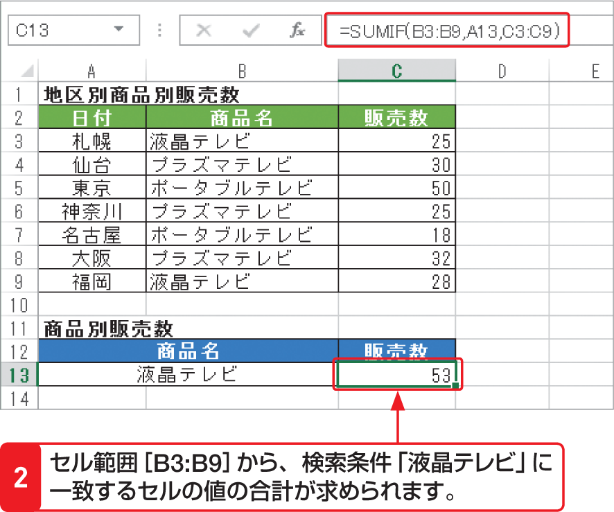

# Section 32 代表的な関数を利用する

## 条件を満たす数値の合計を求める関数－SUMIF

### [Stepup] SUMIFS関数
検索条件を1つしか設定できない「SUMIF関数」に対して、複数の条件を設定できる「SUMIFS 関数」も用意されています。  
<em>書式：</em>＝ SUMIFS（合計対象範囲,条件範囲1, 条件1, 条件範囲2,条件2,…）  
<em>関数の分類：</em>数学／三角関数
