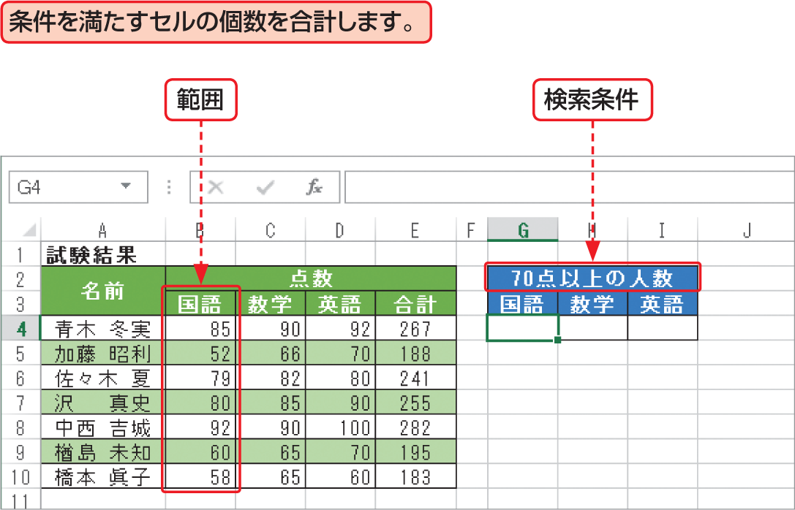

# Section 32 代表的な関数を利用する

## 条件を満たすセルの個数を求める関数－COUNTIF

### [Keyword] COUNTIF関数
「COUNTIF関数」は、引数に指定した範囲から条件を満たすセルの個数を数える関数です。引数「範囲」には、セルの個数を求めるセル範囲を指定します。また、引数「検索条件」には、数える対象となるセルの条件を、数値、式、または文字列で指定します。  
<em>書式：</em>＝ COUNTIF（範囲, 検索条件）  
<em>関数の分類：</em>統計関数
