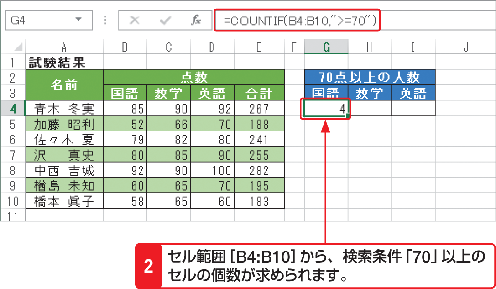

# Section 32 代表的な関数を利用する

## 条件を満たすセルの個数を求める関数－COUNTIF

### [Stepup] COUNTIFS関数
検索条件を1つしか設定できない「COUNTIF関数」に対して、複数の条件を設定できる「COUNTIFS関数」も用意されています。  
<em>書式：</em>＝ COUNTIFS（検索条件範囲1,検索条件1, 検索条件範囲2,検索条件2,…）  
<em>関数の分類：</em>統計関数
