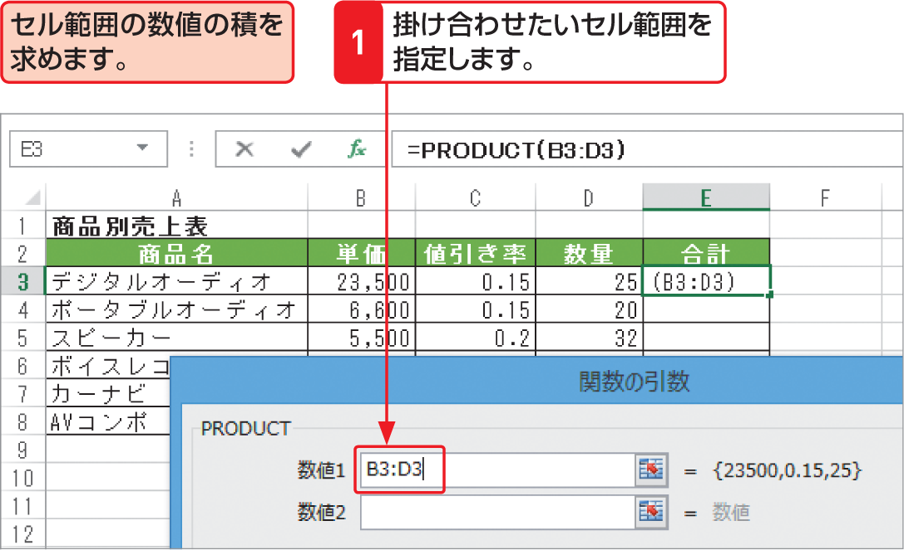

# Section 32 代表的な関数を利用する

## 複数の数値を掛け合わせる関数－PRODUCT

### [Keyword] PRODUCT関数
「PRODUCT関数」は、引数に指定した数値の積を求める関数です。引数として数値やセル参照を使用することもありますが、よく使われるのは、縦1列または横1行に連続したセル範囲の数値の積を求める場合です。  
<em>書式：</em>＝ PRODUCT（数値1, 数値2,…）  
<em>関数の分類：</em>数学／三角関数
