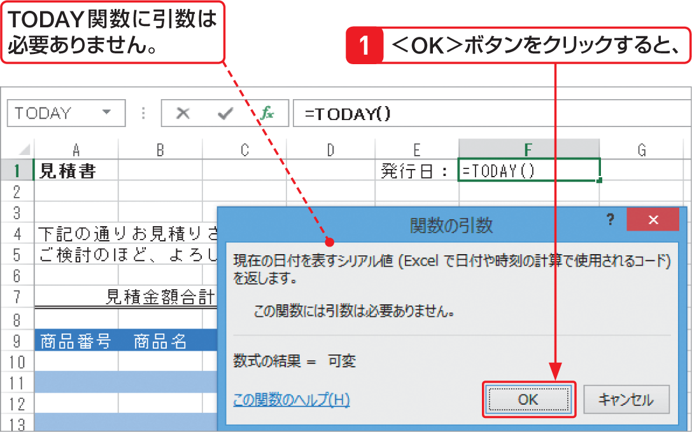

# Section 32 代表的な関数を利用する

## 現在の日付を表示する関数－TODAY

### [Keyword] TODAY関数
「TODAY関数」は、パソコンの内蔵時計を利用して、現在の日付をシリアル値（日付と時刻を管理するための数値）で返す関数です。TODAY関数に引数は必要ありませんが、（ ）は必ず必要です。  
<em>書式：</em>＝ TODAY（ ）  
<em>関数の分類：</em>日付／時刻関数
