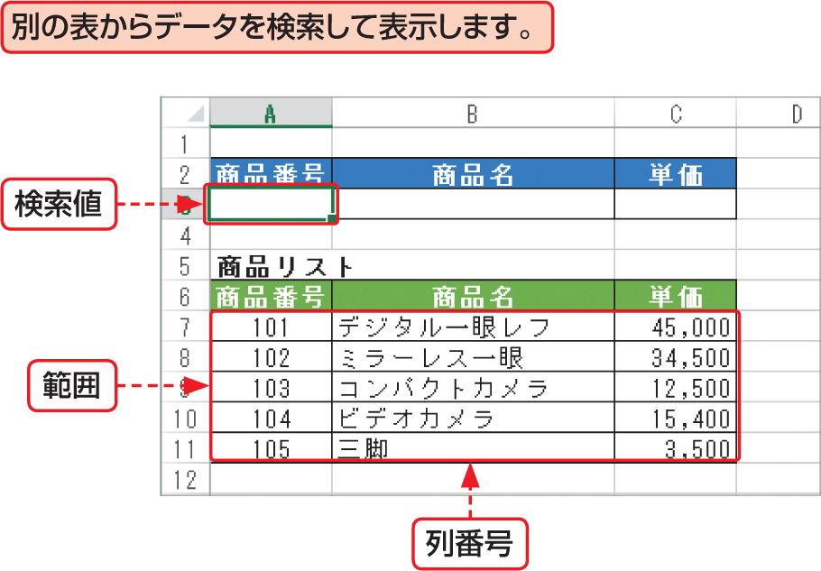

# Section 32 代表的な関数を利用する

## 表から特定のデータを検索する関数－VLOOKUP

### [Keyword] VLOOKUP関数
「VLOOKUP関数」は、引数「範囲」で指定した表の左端列を基準に検索し、引数「検索値」と一致する値がある行と、引数「列番号」で指定した列とが交差するセルの値を返す関数です。  
「検索方法」には、「検索値」が見つからない場合の対処を「1」か「0」で指定します。「1」と指定すると「検査値」未満の最大の値を返し、「0」と指定すると値の代わりにエラー値「&#035;N/A」を返します。  
<em>書式：</em>＝ VLOOKUP（検索値, 範囲, 列番号, 検索方法）  
<em>関数の分類：</em>検索／行列関数
