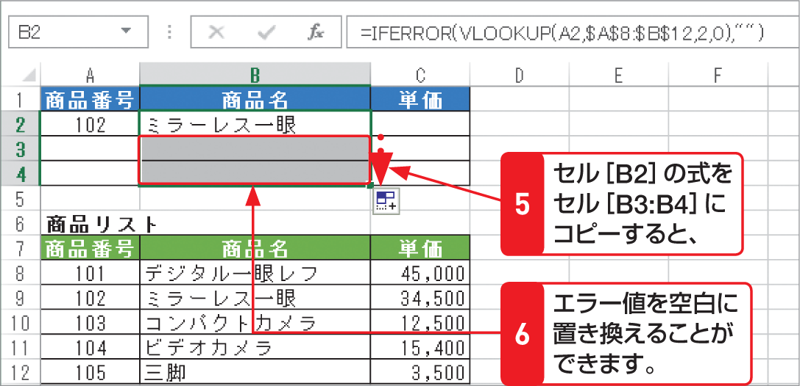

# Section 32 代表的な関数を利用する

## エラー値を表示させない関数－IFERROR

## [Keyword] IFERROR関数

「IFERROR関数」は、指定した数式やセルがエラーだった場合の処理を指定する関数です。指定した数式がエラーの場合に指定の値（図の操作では空白）を返し、それ以外の場合は数式の結果を返します。  
<em>書式：</em>＝ IFERROR（値,エラーの場合の値）  
<em>関数の分類：</em>論理関数
