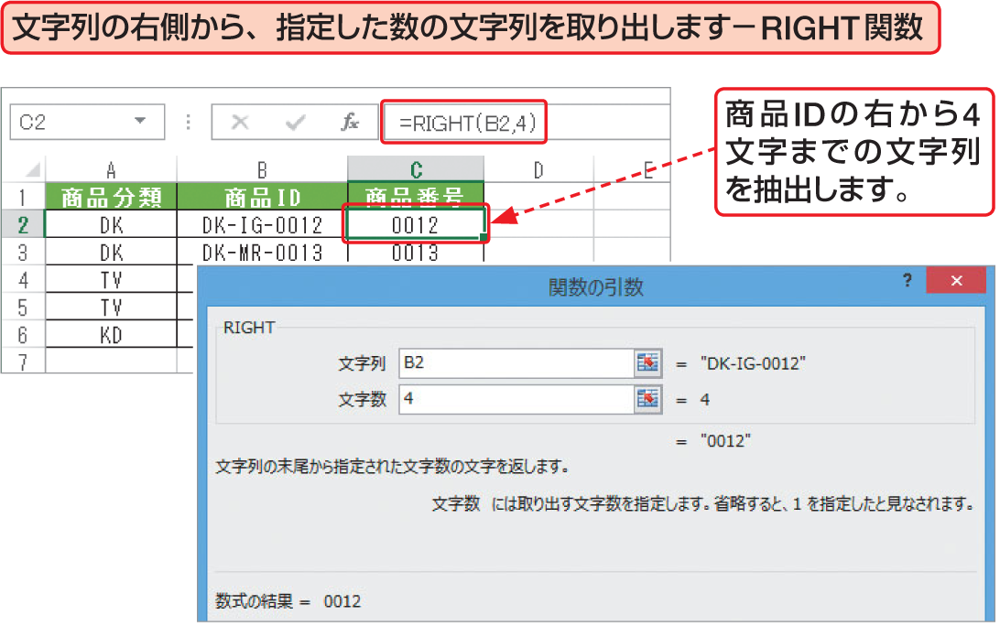

# Section 32 代表的な関数を利用する

## 文字列を操作する関数

### [Keyword] RIGHT関数
「RIGHT関数」は、文字列の末尾（右端）から指定された数の文字を抽出する関数です。引数「文字列」には、取り出したい文字を含む文字列を指定するか、文字列が入力されたセル参照を指定します。全角と半角の区別なく1文字を「1」として処理します。  
<em>書式：</em>＝ RIGHT（文字列, 文字数）

### [Stepup] LEFT関数
「LEFT関数」は、RIGHT関数の逆の関数で、文字列の先頭（左端）から指定された数の文字を抽出します。全角と半角の区別なく1文字を「1」として処理します。  
<em>書式：</em>＝ LEFT（文字列, 文字数）