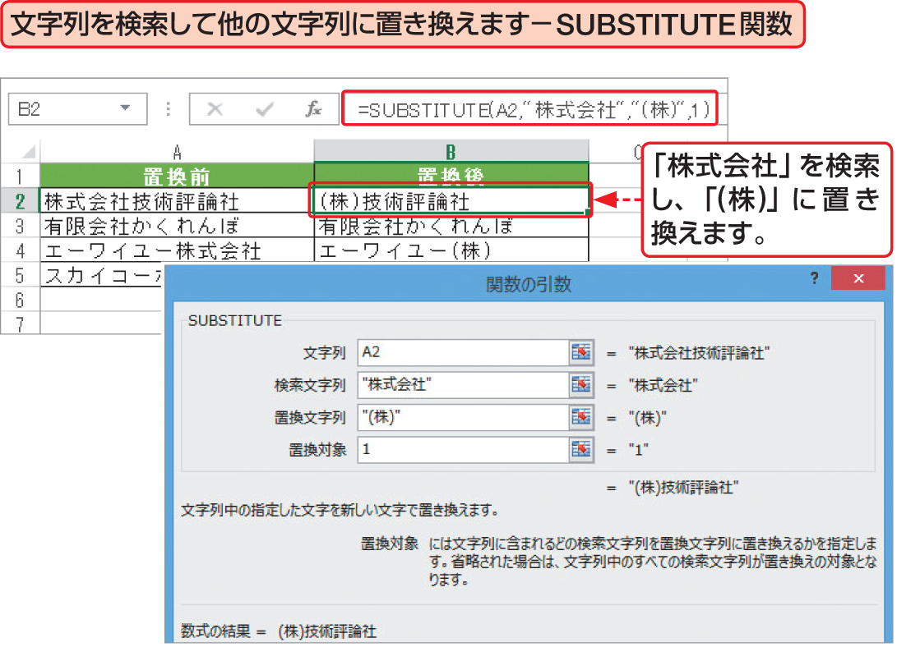

# Section 32 代表的な関数を利用する

## 文字列を操作する関数

### [Keyword] SUBSTITUTE関数
「SUBSTITUTE関数」は、文字列の中から特定の文字列を検索し、指定した文字列に置換する関数です。全角と半角は区別されるので、指定する際は注意が必要です。  
<em>書式：</em>＝ SUBSTITUTE（文字列,検索文字列, 置換文字列, 置換対象）
