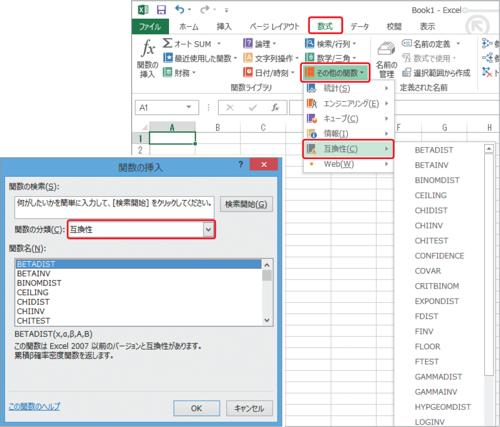

# Section 32 代表的な関数を利用する

## 文字列を操作する関数

### [Keyword] Excel 2013の新しい関数
Excel 2013では、関数の分類に「Web 関数」が追加されたほか、日付／時刻、数学／三角関数、統計、検索／行列、文字列操作、論理、エンジニアリング関数のそれぞれに新しい関数が追加されました。既存の関数についても、名前が変更されたり、機能が更新されたりしています。  
なお、以前のバージョンとの互換性を保つために、古い名前の関数も引き続き使用できます。互換性の関数は、＜関数の挿入＞ダイアログボックスの＜関数の分類＞に＜互換性＞として、あるいは＜数式＞タブの＜関数ライブラリ＞グループにある＜その他の関数＞ボタンをクリックして表示されるメニューに＜互換性＞として用意されています。

