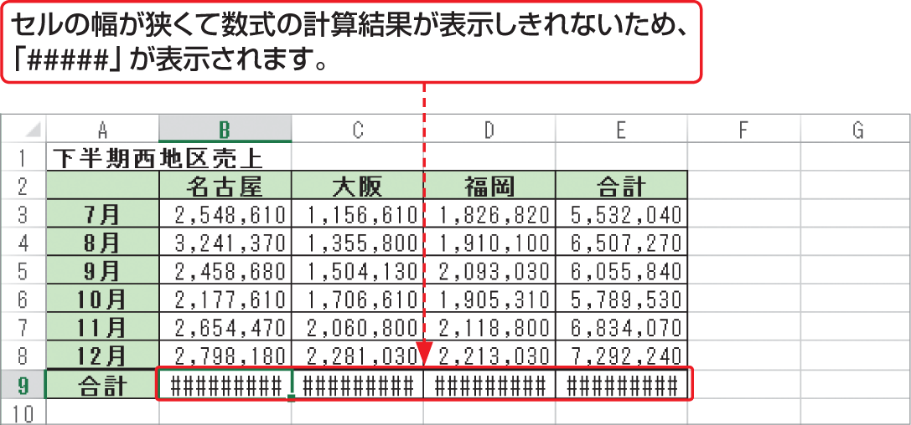

# Section 33 数式のエラーを解決する

## エラー値「&#035;&#035;&#035;&#035;&#035;」が表示されたら…

### [Keyword] エラー値「&#035;&#035;&#035;&#035;&#035;」
エラー値「&#035;&#035;&#035;&#035;&#035;」は、セルの幅が狭くて計算結果を表示できない場合に表示されます。そのため、セルの幅を広げたり、表示する小数点以下の桁数を減らしたりすると、解決されます。また、時間の計算が負になった場合にも表示されます。
