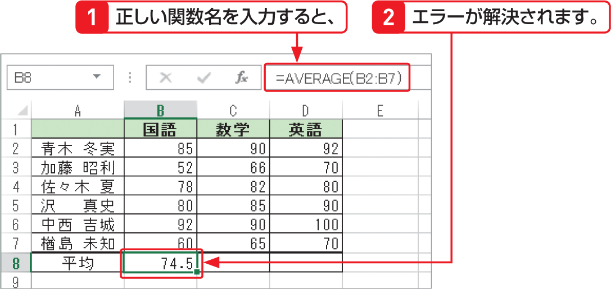

# Section 33 数式のエラーを解決する

## エラー値「&#035;NAME?」が表示されたら…

### [Keyword] アドインとは？
「アドイン」とは外部プログラムのことで、利用するときだけExcelに組み込むしくみになっています。アドインを組み込むには、＜Excelのオプション＞ダイアログボックスを表示して、＜アドイン＞をクリックします。続いて、画面下の＜設定＞ボタンをクリックして表示される＜アドイン＞ダイアログボックスで利用するアドインを選択します。
