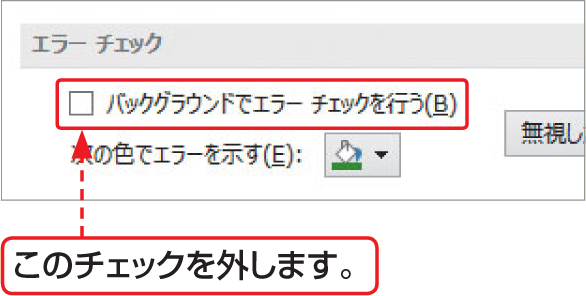

# Section 33 数式のエラーを解決する

## エラー値「&#035;N/A」が表示されたら…

### [Hint] エラーインジケーターを表示しないようにするには？

＜エラーチェックオプション＞ボタン  をクリックすると表示されるメニュー（P.374の上段図参照）から＜ エラーチェックオプション＞をクリックすると、＜Excelのオプション＞ダイアログボックスの＜数式＞が表示されます。＜バックグラウンドでエラーチェックを行う＞のチェックを外すと、エラーインジケーターが表示されなくなります。

