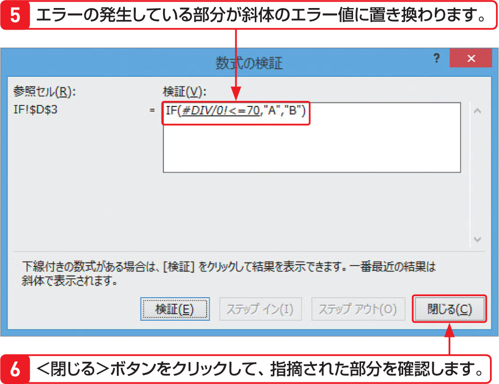

# Section 33 数式のエラーを解決する

## 数式を検証する

### [Hint] ＜エラーチェックオプション＞ボタンのメニュー

＜エラーチェックオプション＞ボタン  をクリックして表示されるメニューからは、以下の機能が選択できます。

&#9312; このエラーに関するヘルプ  
&emsp;このエラーに関するヘルプを表示します。  
&#9313; 計算の過程を表示  
&emsp;右の手順参照。  
&#9314; エラーを無視する  
&emsp;エラーを無視してエラーインジケーターを非表示にします。  
&#9315; 数式バーで編集  
&emsp;数式バーで数式を編集することができます。  
&#9316; エラーチェックオプション  
&emsp;エラーチェックの対象を選択することができます。
