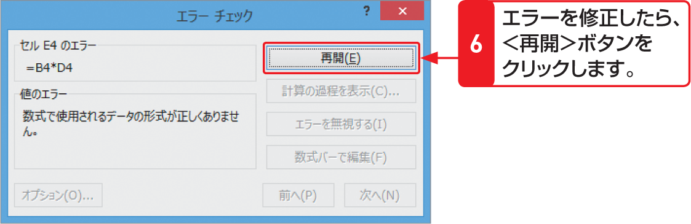

# Section 33 数式のエラーを解決する

## 循環参照を解消する

### [Hint] ワークシート全体のエラーをチェックできる！②

数式を修正したら、図の＜再開＞ボタンをクリックしてエラーのチェックを続けます。  
右の例では、セル［B4］には文字列が入力されているため、「＝B4 ＊ D4」という乗算を行うことができません。＜エラーチェック＞ダイアログボックスで＜数式バーで編集＞ボタンをクリックし、数式を「＝ C4 ＊ D4」と修正します。＜再開＞ボタンをクリックすると、計算が行われます。