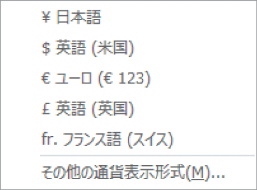

# Section 34 表示形式を変更する

## 表示形式を＜通貨＞スタイルに変更する

### [Hint] 別の通貨記号を使うには

「&yen;」以外の通貨記号を使いたい場合は、＜通貨表示形式＞ボタン  の  をクリックして表示される一覧から利用したい通貨記号を選択します（下図参照）。＜その他の通貨表示形式＞をクリックすると、＜セルの書式設定＞ダイアログボックスが表示され、より多くの通貨記号が選択できます。

