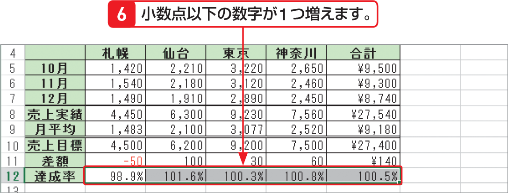
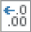
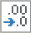

# Section 34 表示形式を変更する

## 表示形式を＜パーセンテージ＞スタイルに変更する

### [Memo] 小数点以下の桁数を変更する

＜ホーム＞タブの＜数値＞グループにある＜小数点以下の表示桁数を増やす＞ボタン  をクリックすると小数点以下の桁数が1つ増え、＜小数点以下の表示桁数を減らす＞ボタン をクリックすると小数点以下の桁数が1つ減ります。この場合、セルの表示上はデータが四捨五入されていますが、実際のデータは変更されません。
