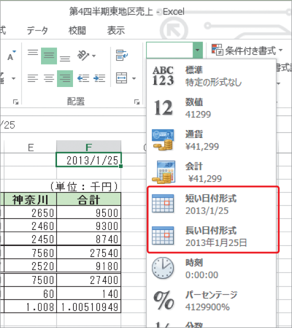

# Section 34 表示形式を変更する

## 日付の表示形式を変更する

### [Memo] 日付の表示形式の変更

＜ホーム＞タブの＜数値＞グループにある＜表示形式＞ボックスの  ボタンをクリックして表示される一覧から＜長い日付形式＞を選択すると、「2013年1月25日」という形式に変更することができます。＜短い日付形式＞を選択すると、元の「2013/1/25」という表示形式に戻ります。

