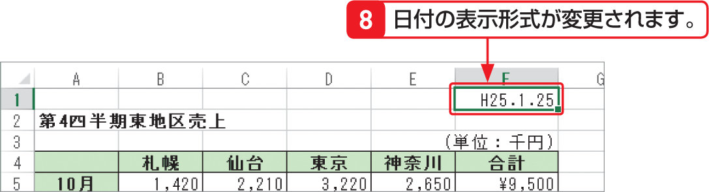

# Section 34 表示形式を変更する

## 日付の表示形式を変更する

### [Memo] 日付や時刻のデータ

Excelでは、日付や時刻のデータは、「シリアル値」という数値で扱われます。＜日付＞スタイルや＜時刻＞スタイルのセルの表示形式を＜標準＞に変更すると、シリアル値が表示されます。たとえば、「2013/1/1 12:00」と表示されているセルの表示形式を＜標準＞にすると、シリアル値の「41275.5」が表示されます。
