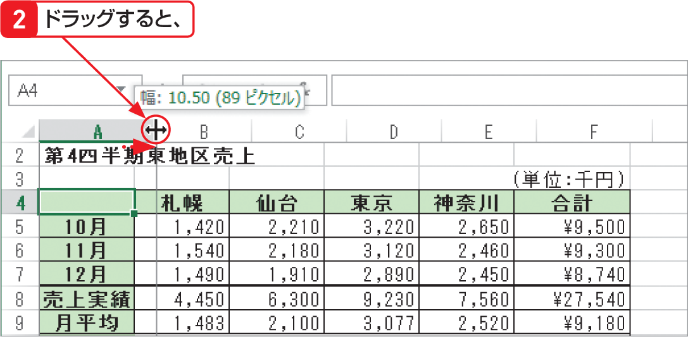

# Section 35 列幅や行の高さを調整する

## ドラッグして列の幅を変更する

### [Hint] 列の幅や行の高さの表示単位

変更中の列の幅や行の高さは、マウスポインターの右上に数値で表示されます（図を参照）。列の幅は、Excelの既定のフォント（11ポイント）で入力できる半角文字の「文字数（ピクセル数）」で、行の高さは、入力できる文字の「ポイント数（ピクセル数）」で表されます。