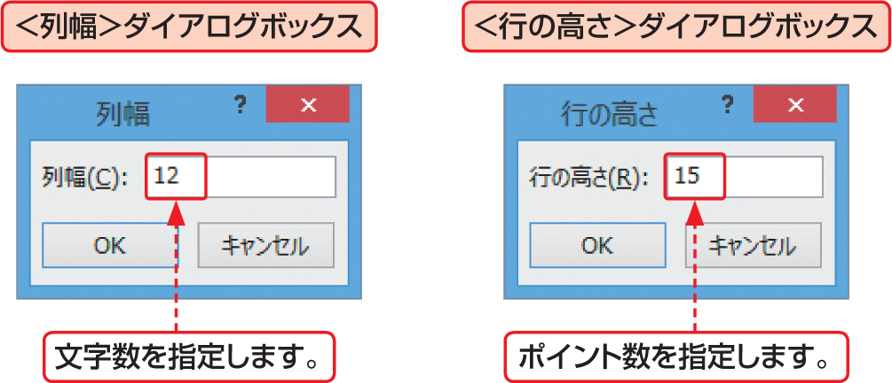

# Section 35 列幅や行の高さを調整する

## セルのデータに列の幅を合わせる

### [Hint] 列の幅や行の高さを数値で指定するには？

列の幅や行の高さは、数値で指定して変更することができます。列の幅は、調整したい列をクリックして、＜ホーム＞タブの＜セル＞グループにある＜書式＞ボタンをクリックし、＜列の幅＞をクリックして表示される＜列幅＞ダイアログボックスで数値を入力します。行の高さは、同様の方法で＜行の高さ＞をクリックして表示される＜行の高さ＞ダイアログボックスで、数値を入力します。

