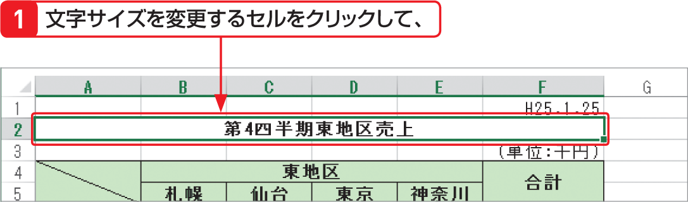

# Section 37 文字サイズやフォントを変更する

## 文字サイズを変更する

### [Memo] 文字サイズの変更

文字サイズの変更は、右の手順のように＜ホーム＞タブの＜フォント＞グループの＜フォントサイズ＞ボックスで行います。また、フォントを変更するセルを右クリックして表示されるミニツールバー上でも変更することができます。なお、Excel の既定のフォントは「MS P ゴシック」、スタイルは「標準」、サイズは「11」ポイントです。

