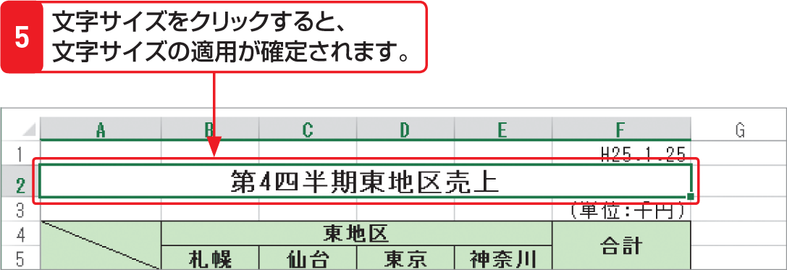

# Section 37 文字サイズやフォントを変更する

## 文字を左揃えのままセルを結合する

### [Memo] 文字サイズを直接入力する

＜フォントサイズ＞ボックスでは、文字サイズの数値を直接入力して設定することもできます。この場合、一覧には表示されない「9.5pt」や「96pt」といった文字サイズを指定することも可能です。なお、「1pt」は1/72インチで、およそ0.35mmです。
